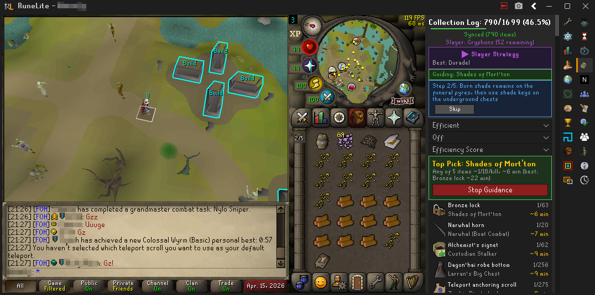
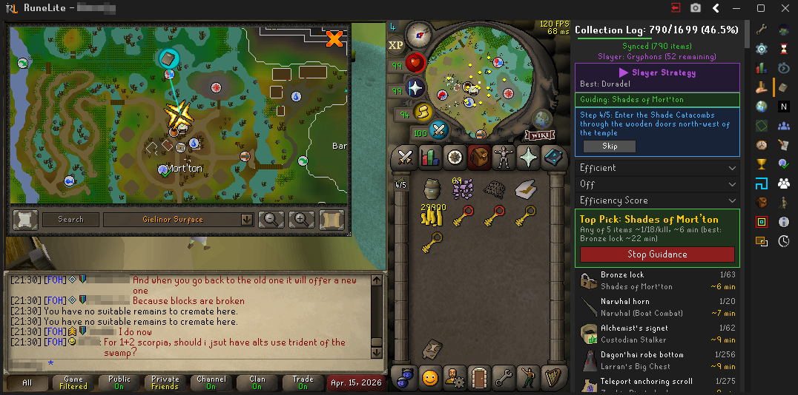
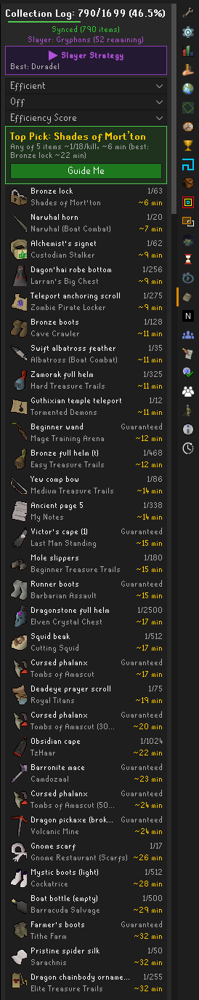
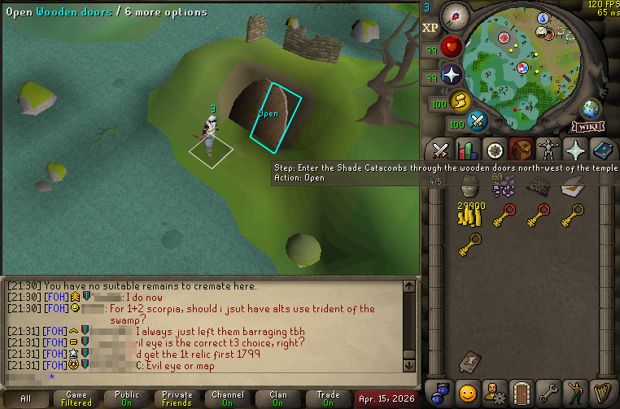
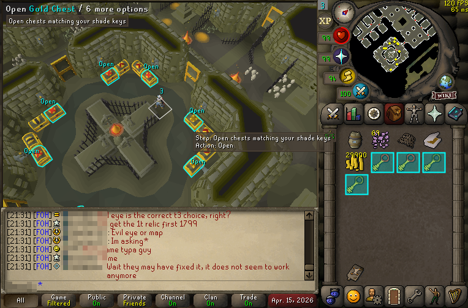
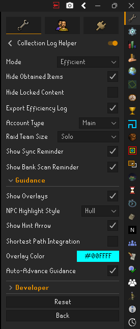

# Collection Log Helper

Ranks every collection log source by efficiency and guides you there step-by-step — like Quest Helper, but for the collection log.

2,109 items across 225 sources. Drop rates wiki-verified. Kill times aligned with TempleOSRS EHB rates.

| Guidance overlays | World map routing |
|:---:|:---:|
| [](docs/screenshots/overlay-1.png) | [](docs/screenshots/worldmap.png) |

## Features

- **Efficiency scoring** — Ranks sources by probability of a new log slot per kill, factoring in drop rates, kill times, multi-table mechanics, raid team sizes, and slayer task overhead
- **Step-by-step guidance** — Click "Guide Me" on any source for tile markers, NPC/object highlights, world map routes, minimap arrows, and auto-completing steps
- **Account-aware** — Detects your quest completions, skill levels, available teleports, and bank contents to recommend only accessible content with travel options you can actually use
- **Five display modes** — Efficient rankings, Category browser, Search, Pet Hunt, and Statistics dashboard
- **Live tracking** — Detects new log entries automatically and recalculates rankings in real time
- **Shortest Path integration** — Routes through the [Shortest Path](https://github.com/Skretzo/shortest-path) plugin if installed

<details>
<summary><strong>Screenshots</strong></summary>
<br>

| Efficiency panel | Step completion | Inventory highlighting |
|:---:|:---:|:---:|
|  |  |  |

| Settings |
|:---:|
|  |

</details>

<details>
<summary><strong>Efficiency scoring details</strong></summary>
<br>

- **Combined-rate scoring** — `1 - Π(1 - p_i)` for all missing items on a source, giving the probability of ANY new log slot per kill
- **Independent drop modeling** — Items on separate tables (pets, mutagens, raid uniques) scored using independent probability
- **Sequential dependencies** — Items requiring predecessors (Bludgeon pieces, Hydra rings, defender chain) excluded until prerequisite is obtained
- **Raid team size scaling** — Solo/Duo/Trio/Full team size affects drop rates and kill times
- **Slayer task overhead** — Task-only sources inflate effective kill time by `1/P(creature|master)` when not on task
- **Main/Ironman toggle** — Separate kill times for accounts with different methods (Corp, GWD, wilderness bosses)
- **Mutually exclusive variants** — Raid difficulties, DT2 Awakened bosses, and shared-loot groups cross-referenced with "(also: ...)" notes

</details>

<details>
<summary><strong>Guidance overlay details</strong></summary>
<br>

- **Tile highlights** — Marker on target locations
- **NPC highlighting** — Hull, outline, or tile highlight with action text
- **Object highlighting** — Thin outline with "Use X on Y" prompts
- **Widget highlighting** — Highlights spells, prayers, equipment in the game interface
- **Inventory item highlighting** — Colored borders on items needed for interactions
- **Ground item highlighting** — Highlights lootable items relevant to current step
- **Dialog highlighting** — Highlights correct dialog choices during NPC interactions
- **World map route** — Colored line with arrowhead from player to target
- **Minimap arrow** — Directional arrow toward off-screen targets
- **Hint arrow** — Native yellow hint arrow (plane-aware)
- **Hover tooltips** — Rich tooltip on highlighted NPCs and objects
- **Right-click menu** — "Collection Log Guide" option on tracked NPCs
- **Item requirement sprites** — Required items shown with green (have) / red (missing) borders
- **Auto-advance** — Completes a sequence, then starts the next best source automatically
- **Auto-arrival/kill detection** — 223 sources detect arrival, 112 detect kills

</details>

<details>
<summary><strong>Configuration</strong></summary>
<br>

| Option | Default | Description |
|--------|---------|-------------|
| Default Mode | Efficient | Startup mode (Efficient, Category Focus, Search, Pet Hunt, Statistics) |
| Hide Obtained Items | On | Hide items already obtained |
| Hide Locked Content | On | Hide sources requiring unmet quests or skills |
| Account Type | Main | Adjusts kill times for main vs ironman |
| Raid Team Size | Solo | Adjusts raid drop rates and kill times |
| AFK Filter | Off | Filter by AFK level (Off, Semi-AFK+, AFK+, Very AFK) |
| Efficient Sort | Efficiency | Sort order in Efficient mode (persisted) |
| Show Sync Reminder | On | Remind to open Collection Log after login |
| NPC Highlight Style | Hull | Hull, outline, or tile for guided NPCs |
| Auto-Advance Guidance | On | Auto-start next source when a sequence completes |
| Show Overlays | On | Toggle all guidance overlays |
| Show Hint Arrow | On | Yellow hint arrow at target |
| Shortest Path Integration | On | Route via Shortest Path plugin |
| Overlay Color | Cyan | Customize highlight color |

</details>

## Building

```bash
./gradlew build
```

Requires Java 11+. Uses RuneLite client API, Lombok, and JUnit 4.

## Contributing

See [CONTRIBUTING.md](CONTRIBUTING.md) for the JSON schema reference, data sourcing tiers, and PR process.

## Acknowledgments

References patterns from [Quest Helper](https://github.com/Zoinkwiz/quest-helper) (hint arrows, overlays, step sequencing) and [Shortest Path](https://github.com/Skretzo/shortest-path) (pathfinding). Scoring data validated against the [Log Hunters](https://discord.gg/loghunters) community spreadsheet. See [CREDITS.md](CREDITS.md) for full details.

## License

BSD 2-Clause
